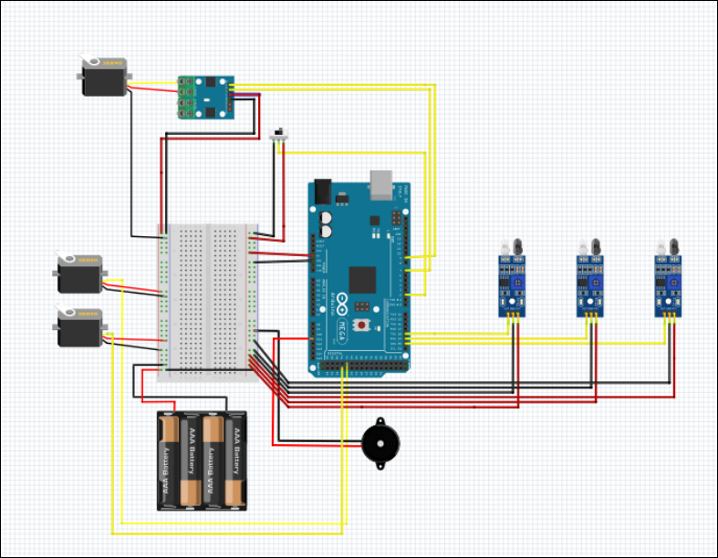

# Arduino 기반 전자부품 자동 검사·분류 시스템 하드웨어 제어

컨베이어 벨트 위의 전자부품을 AI 비전으로 검사하고, 판정 결과에 따라 서보모터를 이용해 자동으로 분류하는 제조 검사 시스템입니다.

Arduino MEGA 2560을 기반으로 컨베이어 모터, 적외선 센서, 서보모터, 비상정지 버튼 및 부저를 제어했으며, PC와의 시리얼 통신을 통해 검사 결과와 제어 명령을 전달받도록 구현했습니다.

| 구분 | 내용 |
|---|---|
| 수행 기간 | 2026.04.22 ~ 2026.05.04 |
| 인원 | 5명 |
| 담당 역할 | 전체 하드웨어 구조 설계·제작 및 Arduino 통합 제어 |
| 개발 환경 | Arduino IDE, C/C++, C# (.NET Core), Arduino MEGA 2560, ArduinoJson, Servo |

[▶ 프로젝트 동작 영상 보기](https://youtu.be/iOWE4XQoLik?si=l-e_d4PTTN3qSnhg)

---

## 전체 회로도



---

## 시스템 동작 순서

1. PC에서 시작 명령을 보내면 컨베이어 벨트가 작동합니다.
2. 전자부품이 컨베이어를 따라 검사 위치로 이동합니다.
3. 적외선 센서가 전자부품의 도착 여부를 감지합니다.
4. 전자부품이 검사 위치에 도착하면 컨베이어를 일정 시간 정지시킵니다.
5. PC의 AI 비전 시스템이 전자부품의 상태를 검사합니다.
6. PC가 정상, 불량 또는 판정 불가 결과를 Arduino로 전달합니다.
7. Arduino가 검사 결과에 맞는 서보모터를 동작시켜 전자부품을 분류합니다.
8. 분류가 끝나면 서보모터가 원래 위치로 돌아갑니다.
9. 컨베이어가 다시 작동하여 다음 전자부품을 검사합니다.
10. 비상정지 버튼이 눌리면 컨베이어와 서보모터를 정지시키고 부저를 울립니다.

---

## 하드웨어 구성

| 부품 | 역할 |
|---|---|
| Arduino MEGA 2560 | 센서 입력, 모터 및 전체 하드웨어 제어 |
| DC Motor | 컨베이어 벨트 구동 |
| Motor Driver | DC 모터의 속도와 방향 제어 |
| IR Sensor | 전자부품 위치와 검사 위치 도착 여부 감지 |
| Servo Motor | 검사 결과에 따른 전자부품 분류 |
| Emergency Stop Button | 비상 상황에서 전체 장비 정지 |
| Buzzer | 비상정지 및 이상 상태 알림 |
| DHT22 | 장비 주변 온도 측정 |
| Battery Pack | 모터와 구동부 전원 공급 |

---

## 주요 제어 기능

### 컨베이어 모터 제어

모터 드라이버와 PWM 제어를 이용해 컨베이어 벨트의 이동 속도를 조절했습니다.

적외선 센서가 전자부품을 감지하면 컨베이어를 일정 시간 정지시키고, 검사 및 분류가 끝난 뒤 다시 작동하도록 구현했습니다.

### 적외선 센서 기반 물체 감지

적외선 센서를 이용해 전자부품의 이동 위치와 검사 위치 도착 여부를 확인했습니다.

센서가 같은 부품을 여러 번 감지하지 않도록 입력이 일정 시간 유지되었을 때 한 번만 처리하고, 부품이 센서 위치를 벗어난 뒤 다음 감지를 받을 수 있도록 구성했습니다.

### 서보모터 자동 분류

PC에서 전달받은 검사 결과에 따라 각 분류 위치의 서보모터가 동작하도록 구현했습니다.

전자부품이 분류 위치에 도착했을 때 서보모터가 작동하고, 분류가 끝나면 자동으로 원래 위치로 돌아가도록 제어했습니다.

### 비상정지 및 부저 알림

비상정지 버튼이 눌리면 컨베이어와 서보모터를 즉시 정지시키고, 부저를 울려 작업자에게 정지 상태를 알리도록 구현했습니다.

### PC 시리얼 통신

PC와 Arduino 사이에 JSON 기반 시리얼 통신을 적용하여 시작·정지 명령, 모터 상태, 서보모터 동작 명령과 센서값을 주고받도록 구성했습니다.

PC에서 일정 시간 동안 명령이 들어오지 않으면 통신이 끊긴 것으로 판단하고 컨베이어를 자동으로 정지하도록 안전 기능을 추가했습니다.

---

## 통신 데이터

Arduino와 PC 간 데이터는 JSON 형식으로 구성했습니다.

```json
{
  "cmd": "start",
  "speed": 150,
  "sensor": 0,
  "temp": 24.5
}
```

| 데이터 | 설명 |
|---|---|
| `cmd` | 시작, 정지, 모터 및 서보모터 동작 명령 |
| `speed` | 컨베이어 모터 속도 |
| `sensor` | 적외선 센서 감지 상태 |
| `temp` | 온도 센서 측정값 |

---

## 소스 코드

| 파일 | 내용 |
|---|---|
| [`manufacturing_hardware.ino`](./manufacturing_hardware.ino) | 핀 설정, 공통 변수, `setup()`과 `loop()` |
| [`Communication.ino`](./Communication.ino) | PC 시리얼 통신, JSON 명령 처리 및 상태값 전송 |
| [`ConveyorControl.ino`](./ConveyorControl.ino) | 적외선 센서 감지와 컨베이어 모터 정지·재시작 |
| [`ServoControl.ino`](./ServoControl.ino) | 검사 결과에 따른 서보모터 분류 및 원위치 복귀 |
| [`EmergencyStop.ino`](./EmergencyStop.ino) | 비상정지 버튼 입력과 부저 경고 |

---

## 내가 맡은 부분

- 프로젝트에 사용된 전체 하드웨어 구조 설계 및 제작
- Arduino MEGA 2560 기반 제어 회로와 전체 배선 구성
- 컨베이어 벨트, DC 모터 및 모터 드라이버 설치
- PWM을 이용한 컨베이어 모터 속도 제어
- 적외선 센서 설치 위치 선정과 물체 감지 기능 구현
- 검사 위치 도착 시 컨베이어 정지 및 재구동 로직 구현
- 검사 결과에 따른 서보모터 자동 분류 동작 구현
- 비상정지 버튼과 부저 경고 기능 구현
- DHT22 온도 센서 연결 및 측정값 전송
- PC와 Arduino 사이의 JSON 기반 시리얼 통신 구현
- 전체 하드웨어 통합, 반복 동작 테스트 및 오류 수정

---

## 저장소 구성

```text
smart-manufacturing-hardware
├── Communication.ino
├── ConveyorControl.ino
├── EmergencyStop.ino
├── README.md
├── ServoControl.ino
├── manufacturing_hardware.ino
└── docs
    └── circuit
        └── hardware_circuit.png
```
